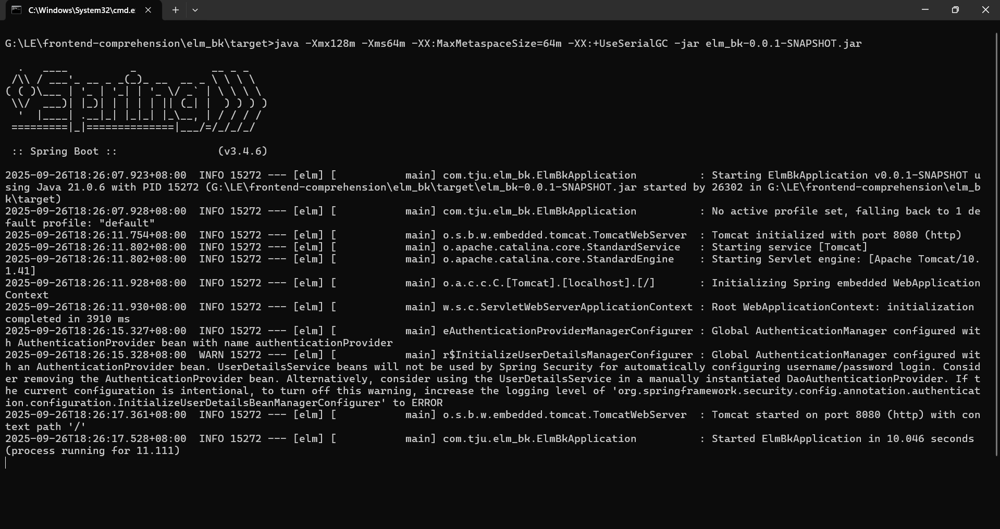
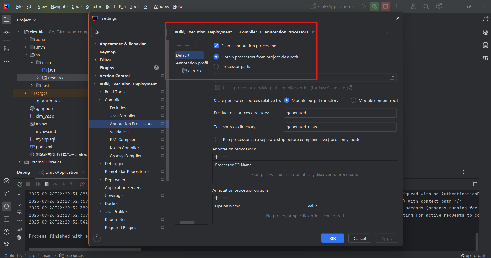
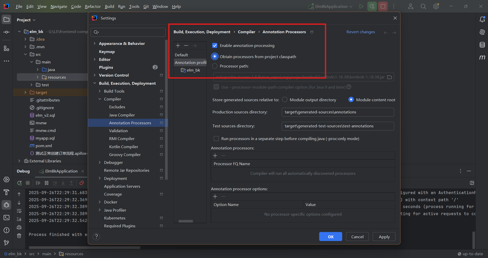

# 软件工程综合实践饿了么项目

## 0 新成员先看这里

- 想快速理解代码职责和订单调用链：阅读 [架构与改需求指南](./架构与改需求指南.md)。
- 想启动并完整走一遍四端流程：阅读 [演示回归与开发清单](./演示回归与开发清单.md)。
- 本项目采用 Vue 3 前端、Spring Boot 后端和 MySQL；业务规则以后端为准，前端提交的身份、价格、优惠和订单总额都不能直接相信。

## 1 项目结构

后端代码存放目录  elm_bk

前端代码存放目录  elmclient

## 2 项目部署

注：

1.如需验收整个项目(即前后端完整效果)，请使用我们提供的sql建库并在配置文件中使用它，以下会详细说明

2.以下部署说明主要针对win系统，Linux系统部署方法命令行操作类似

可参考 [从0开始在linux服务器上部署SpringBoot和Vue_vue项目linux部署-CSDN博客](https://blog.csdn.net/m0_53140426/article/details/144745031?ops_request_misc=%257B%2522request%255Fid%2522%253A%2522061248a22aceb1ff2288a8b50a813a59%2522%252C%2522scm%2522%253A%252220140713.130102334.pc%255Fall.%2522%257D&request_id=061248a22aceb1ff2288a8b50a813a59&biz_id=0&utm_medium=distribute.pc_search_result.none-task-blog-2~all~first_rank_ecpm_v1~rank_v31_ecpm-2-144745031-null-null.142^v102^pc_search_result_base7&utm_term=Linux%E9%83%A8%E7%BD%B2spingboot%E5%92%8Cvue&spm=1018.2226.3001.4187)

#### 2.1 后端部分

基于 SpringBoot，Maven，Mybatis

##### 开发环境

JDK 17

SpringBoot 3.4.6

Mybatis 3.0.4

MySQL版本信息：

```
 Source Server         : localhost
 Source Server Type    : MySQL
 Source Server Version : 80040 (8.0.40)
 Source Host           : localhost:3306
 Source Schema         : elm_v2

 Target Server Type    : MySQL
 Target Server Version : 80040 (8.0.40)
 File Encoding         : 65001
```

##### 配置

- 配置文件数据库修改
  
  ```
  frontend-comprehension/elm_bk/src/main/resources/application.yml
  ```
  
  将数据库配置改为您本地的配置，包括：
  
  url(主要是数据库名)，username，password

- 如果可以使用我们的数据库(为添加拓展功能，我们新增了一些表和字段)，请在本地新建一个名为 **elm_v2** 的数据库，并运行以下路径中的建表语句：
  
  ```
  frontend-comprehension/elm_bk/elm_v2.sql
  ```

##### 部署运行

- 如果仅在本地测试后端接口
  
  检查完版本(重点检查jdk)并修改数据库配置信息后，在idea中启动项目后端部分:
  
  ```
  frontend-comprehension/elm_bk
  ```

- 如果需要部署
  
  1.打包
  
  若使用IDEA打包项目，先 clean，再 package，成功控制台如图
  
  若使用命令行打包：
  
  在 /frontend-comprehension/elm_bk 中打开cmd，执行：
  
  ```bash
  mvn clean package
  ```
  
  成功如下图：
  
  
  
  生成的项目jar包路径在:
  
  ```
  frontend-comprehension/elm_bk/target/elm_bk-0.0.1-SNAPSHOT.jar
  ```
  
  2.命令行在jar包存放的目录中执行:
  
  ```bash
  java -jar elm_bk-0.0.1-SNAPSHOT.jar
  ```
  
  如果出现报错 "error='页面文件太小，无法完成操作。' (DOS error/errno=1455)" 请重新执行以下命令:
  
  ```bash
  java -Xmx128m -Xms64m -XX:MaxMetaspaceSize=64m -XX:+UseSerialGC -jar elm_bk-0.0.1-SNAPSHOT.jar
  ```
  
  注：该命令进行了内存配置
  
  后端配置端口为 8080，请注意端口占用
  
  3.当终端出现以下界面，则启动成功：
  
  

如使用IDEA在启动或打包项目时遇到控制台报错如 "找不到符号"，请确保以下位置选择正确





### 2.2 前端部分

基于 Vue3

##### 环境准备

- 保证npm可用
  
  可参见 [VUE安装及环境配置（完整版）-CSDN博客](https://blog.csdn.net/qq_52611686/article/details/142653081?ops_request_misc=%257B%2522request%255Fid%2522%253A%2522b9220596f6cbffa1a2f0eb8c533005ed%2522%252C%2522scm%2522%253A%252220140713.130102334..%2522%257D&request_id=b9220596f6cbffa1a2f0eb8c533005ed&biz_id=0&utm_medium=distribute.pc_search_result.none-task-blog-2~all~top_positive~default-1-142653081-null-null.142^v102^pc_search_result_base7&utm_term=vue%E5%AE%89%E8%A3%85%E5%8F%8A%E7%8E%AF%E5%A2%83%E9%85%8D%E7%BD%AE&spm=1018.2226.3001.4187)

- node
  
  可参见 [Node.js安装与配置（详细步骤）_nodejs安装及环境配置-CSDN博客](https://blog.csdn.net/qq_42006801/article/details/124830995?ops_request_misc=%257B%2522request%255Fid%2522%253A%2522363c66d0a867fcac896383171b678743%2522%252C%2522scm%2522%253A%252220140713.130102334..%2522%257D&request_id=363c66d0a867fcac896383171b678743&biz_id=0&utm_medium=distribute.pc_search_result.none-task-blog-2~all~top_positive~default-1-124830995-null-null.142^v102^pc_search_result_base7&utm_term=%E9%85%8D%E7%BD%AEnode&spm=1018.2226.3001.4187)

##### 运行

- 如在ide里直接启动
  
  1.可以使用 Visual Studio Code 打开项目前端部分:
  
  ```
  frontend-comprehension/elmclient
  ```
  
  2.在其终端 TERMINAL 安装依赖 (请先确保具有vue环境与npm):
  
  ```bash
  npm -i
  ```
  
  如果失败，则尝试:
  
  ```bash
  cnpm -i
  ```
  
  3.启动
  
  ```bash
  npm run serve
  ```
  
  当终端出现访问url，则启动成功。访问url即可跳转至项目首页(在此之前请保证后端项目已启动)

- 如要进行部署(已配置node)
  
  以下内容参考 [Vue前端项目部署的三种方案_vue项目部署-CSDN博客](https://blog.csdn.net/qq_44741577/article/details/139236697?ops_request_misc=%257B%2522request%255Fid%2522%253A%252201c3d7a19a919480657fd6784f177099%2522%252C%2522scm%2522%253A%252220140713.130102334..%2522%257D&request_id=01c3d7a19a919480657fd6784f177099&biz_id=0&utm_medium=distribute.pc_search_result.none-task-blog-2~all~sobaiduend~default-1-139236697-null-null.142^v102^pc_search_result_base7&utm_term=%E5%89%8D%E7%AB%AFvue%E9%A1%B9%E7%9B%AE%E9%83%A8%E7%BD%B2&spm=1018.2226.3001.4187)
  
  注：由于前端请求接口时使用本地路径前缀，请将前后端部署在同一台计算机上，保证可以localhost本地访问，否则需要修改所有前端代码接口请求路径localhost为指定域名或ip，以及前端AdminHome.vue、MerchantOrders.vue、MyInformation.vue、Notifications.vue、OrderList.vue中的WebSocket请求路径（目前是{wsProtocol}//localhost:8080/ws/{sid}）
  
  1.在 **/node/nodejs/** 下新建一个名为 **my_server** 的文件夹，在此文件夹下打开cmd命令行终端 (注：最好使用管理员身份打开)
  
  2.执行：
  
  ```bash
  npm init -y
  ```
  
  出现以下输出则成功：
  
  
  
  3.安装快速部署插件 **express**
  
  ```bash
  npm i express
  ```
  
  4.在前面创建的 **my_server** 目录下新建文件 server.js，内容如下:
  
  ```js
  // 引入express
  const express = require("express");
  // 配置端口号
  const PORT = 8081;
  // 创建一个app服务实例
  const app = express();
  // 配置静态资源
  app.use(express.static(__dirname + "/public"));
  
  // 绑定端口监听
  app.listen(PORT, () => {
    console.log(`本地服务器启动成功，http://localhost:${PORT}`);
  });
  ```
  
  5.在 **my_server** 文件夹下新建文件夹 **public**，后续用于存放vue项目的文件
  
  6.打包前端代码
  
  - 直接将以下路径目录中的所有东西复制到前面创建的 **my_server** 文件夹下的 **public** 中。若之后在下面第7点出现失败，请尝试自己打包(如下一点)
    
    ```
    frontend-comprehension/elmclient/dist/
    ```
  
  - 自己打包：
    
    使用ide (Visual Studio Code) 或者是命令行终端打开项目的前端部分:
    
    ```
    frontend-comprehension/elmclient
    ```
    
    执行:
    
    ```bash
    npm i    #如失败则尝试 cnpm i
    npm run build
    ```
    
    项目文件 **elmclient** 下中将出现文件夹 **dist**，之后同上
  
  7.在 **my_server** 目录下打开cmd，执行:
  
  ```bash
  node .\server.js
  ```
  
  出现以下输出则启动成功，可以通过输出的url访问到app的首页
  
  ```
  本地服务器启动成功，http://localhost:8081
  ```

## 3 自动测试接口异常情况描述

以下将说明对于老师需要测试的接口我们的设计，具体设计在什么情况下响应为 *false* 或验证点

### POST /api/users - 新增用户(仅登录账号)

- 请求头中未携带有效的认证token，或token已过期、签名无效

- 非管理员角色尝试创建用户

- 传入的用户名为空字符串、纯空格或null

- 创建时使用的用户名在数据库中已存在

- 插入用户权限时权限名称不存在于authority表

- 用户保存成功后查询用户详情时返回null

### GET /api/user - 获取当前登录用户

- 请求头中未携带有效的认证token，或token已过期、签名无效
- 当前用户已被删除（is_deleted=true）
- 当前用户已被禁用（activated=false）
- 从SecurityContextHolder中获取用户信息失败

### POST /api/password - 修改密码

- 请求头中未携带有效的认证token，或token已过期、签名无效

- 普通用户尝试修改其他用户的密码（非管理员）

- 传入的用户名或密码为null

- 请求中指定的目标用户名不存在

### POST /api/persons - 新增自然人用户

- 请求头中未携带有效的认证token，或token已过期、签名无效

- 非管理员用户尝试创建自然人用户

- 用户名长度不在**1-100**个字符之间

- 自然人信息中邮箱格式不符合规范

- 电话号码格式不符合规范

- 指定的权限列表包含authority表中不存在的权限名称

- 用户创建成功但自然人信息插入失败导致数据不一致

### POST /api/register - 顾客注册接口

- 注册时用户名已被其他用户占用
- 用户名长度不在**1-100**个字符之间
- 邮箱格式不符合规范
- 手机号码格式不符合规范
- 数据库authority表中USER角色被意外删除或禁用
- 事务处理过程中出现回滚情况

### POST /api/auth - 身份认证获取令牌

- 用户名或密码为null
- 用户名长度不在**1-100**个字符之间
- 用户名在系统中不存在
- 用户输入的密码与数据库存储的加密密码不匹配
- 用户账户被禁用（activated=false）
- 用户账户被标记为已删除（is_deleted=true）
- 令牌生成过程中出现加密异常

### POST /api/addresses - 新增地址

- 请求头中未携带有效的认证token，或token已过期、签名无效
- 联系人电话不符合手机号格式
- 关联用户信息中用户名为空字符串、纯空格或null
- 当前登录用户在数据库中不存在
- 目标关联用户在数据库中不存在
- 普通用户尝试为其他用户创建地址（非管理员权限）

### GET /api/businesses/{id} - 根据ID获取店铺详情

- 传入的id 为空或≤ 0，抛异常

- 返回商铺的is_delete字段为0

- 考虑到现实生活场景，未设置权限验证

### PUT&PATCH /api/businesses/{id} - 更新某店铺信息

- 传入的id 为空或≤ 0，抛异常

- 检测到当前用户为null，抛异常NOT_FOUND

- 用户没有 BUSINESS 或 ADMIN 权限，抛异常权限不足

- 如果不是管理员，且传入的商铺id不属于当前用户、如果不是管理员，且传入的businessOwner的username对应的user_id不是自己的，两种都抛异常：无法对别的用户进行操作

- 如果是管理员，需要将传入的username对应的user_id传入business表的user_id，不然会导致数据不一致的情况

- 如果数据库返回result为0，跑异常商家不存在；

- 如果传入的BusinessOwner的username字段为空，抛异常（根据教师的apifox文档说明设置的）

### DELETE /api/businesses/{id} - 删除某商家

- 传入的id 为空或≤ 0，抛异常

- 如果没有 BUSINESS 权限且不是 ADMIN，则抛出权限不足

- 如果不是管理员，判断是不是自己操作自己的店铺，获取当前用户的id，根据user_id查询business表获取该用户所拥有的所有店铺id的List，判断要修改的id是否在里面，如果不在，抛权限不足

- 如果数据库执行的结果返回0，抛商铺不存在

### GET /api/businesses - 获取所有商铺列表

考虑到现实生活场景，未设置权限验证

### POST /api/businesses - 新增商铺

- 如果当前用户不在users表里面，抛用户不存在

- 检查用户是否有 BUSINESS 或 ADMIN 权限，都不是，抛权限不足异常

- 是商家：传入的username对应的user_id与currentUser的user_id是否一致

### GET /api/foods 获取某商家或某订单的商品列表

考虑到现实生活场景，未设置特别验证

### PATCH /api/foods/{id} 修改商品的信息

- 管理员可以修改所有的商品信息

- 普通商家仅能修改自己商铺的商品

- 若传入的id不存在对应食品，抛异常

### POST /api/foods - 添加商品

- 管理员可以为指定商铺添加

- 普通商家仅能添加自己商铺的商品

- 校验商铺id以及数据库必填字段不为空

- 价格不能为负

### GET /api/foods/{id} - 返回查询到的一条商品记录

考虑到现实生活场景，未设置特别验证

### POST /api/carts - 向用户购物车添加商品

- 不能向别的用户的购物车添加商品

### GET /api/orders - 获取某用户的订单列表

- 非管理员不能查看别的用户的订单

### POST /api/orders - 创建订单

- 不能为别的用户创建订单

### GET /api/orders/{id} - 根据id获取指定订单信息

- 不能查看不是自己下的订单，商家用户不能查看非本商家的订单

## 后端环境变量

启动 `elm_bk` 前请设置以下环境变量：

- `DB_URL`：MySQL JDBC 地址，未设置时使用 `jdbc:mysql://localhost:3306/elm_v2`
- `DB_USERNAME`：MySQL 用户名，未设置时使用 `root`
- `DB_PASSWORD`：MySQL 密码
- `JWT_SECRET`：JWT 签名密钥（必填）
- `DEEPSEEK_API_KEY`：DeepSeek API Key（使用 AI 功能时填写）
- `ALIYUN_OSS_ACCESS_KEY_ID` / `ALIYUN_OSS_ACCESS_KEY_SECRET`：文件上传凭据
- `VUE_APP_AMAP_KEY`：前端高德地图 Web 服务 Key，配置在 `elmclient/.env.local`

## Docker 演示

首次运行“双击启动”脚本时会在项目根目录生成仅供本机使用的 `.env`，其中包含随机 JWT 签名密钥；该文件已被 Git 忽略，请勿提交或分享。

本地演示可执行 `./scripts/ensure-demo-env.sh && docker compose -f docker-compose.demo.yml up -d --build`，前端地址为 `http://localhost:18081`；公网临时分享可执行 `./scripts/ensure-demo-env.sh && docker compose -f docker-compose.demo.yml --profile share up -d --build`。

课程演示环境会设置 `APP_DEMO_ENABLED=true`，用于开放模拟支付、余额充值和免费会员。正式部署必须保持该配置为 `false`，并接入支付平台的服务端签名回调后才能开放真实支付。
